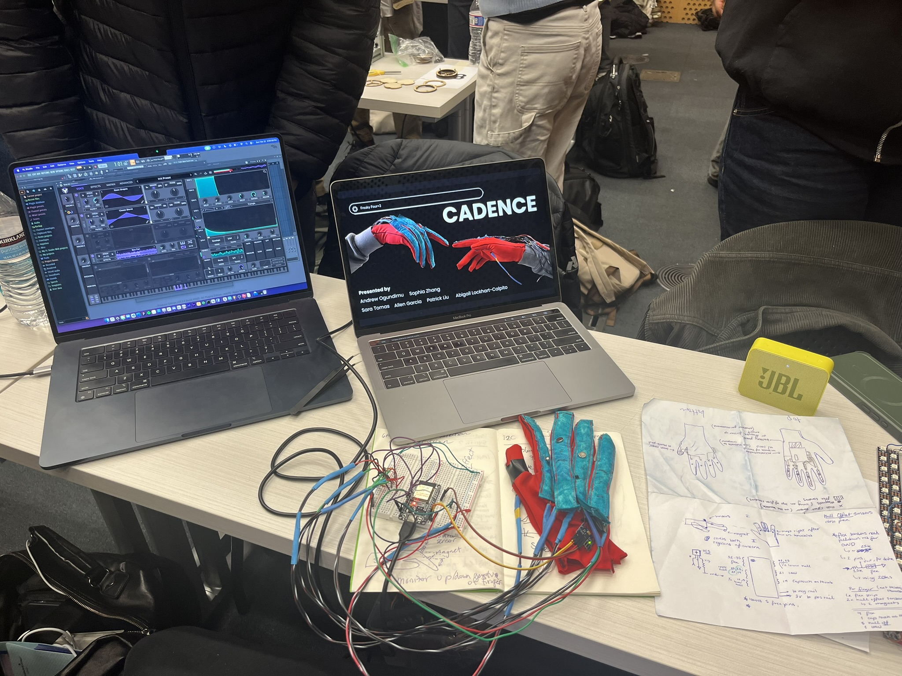
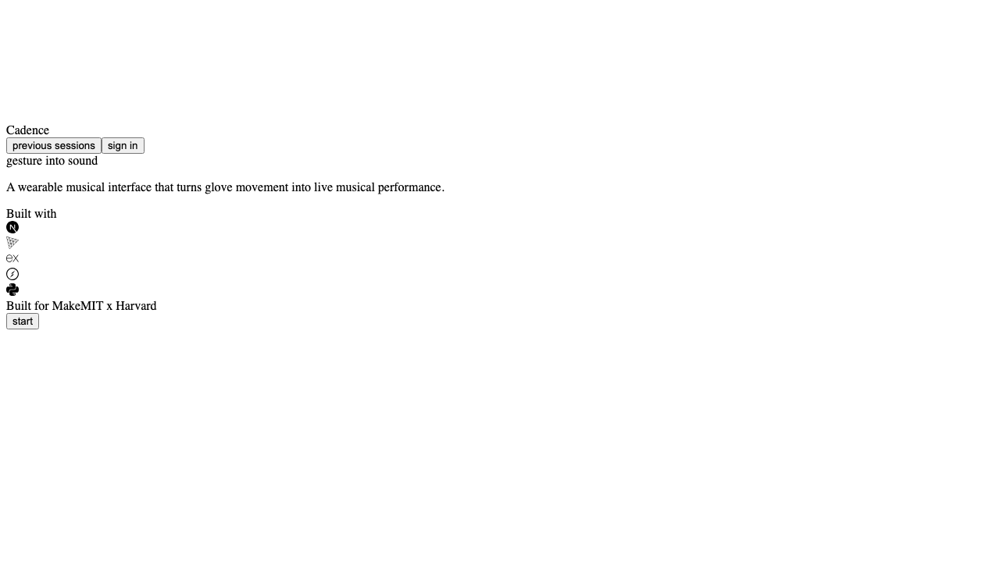

# Cadence



Cadence is a wearable musical interface built at MakeMIT 2026. It combines an ESP32-based sensing glove, a Python sensor-fusion runtime, and an immersive web companion that visualizes live performance data in real time.

At a systems level, Cadence is an end-to-end telemetry pipeline:

- ESP32 glove ingests bend, pressure, hall-effect, and IMU signals
- Python fuses glove telemetry with MediaPipe hand tracking
- Node.js + Socket.IO stream live state to the web client
- Sessions can be logged locally and extended to PostgreSQL + Vultr

## Software Preview



The web companion is designed as a live performance surface, not just a debug dashboard. It includes a 3D scene, a focused live console for gesture, motion, and harmony, and a harmony view driven by the runtime's live note and chord state.

See also: [software walkthrough / screen recording](assets/software-walkthrough.mp4)

## What The Glove Captures

- Four flex sensors for finger bend
- A thumb pressure sensor
- Three hall-effect sensors for discrete triggers
- An MPU-6050 IMU for motion and orientation

## What The Software Does

The Python runtime:

- reads telemetry from the glove
- tracks the hand with MediaPipe
- fuses glove and camera signals for more stable gesture detection
- maps gestures to notes, chords, and expressive controls
- logs sessions for replay and analysis

The web companion:

- renders a live 3D performance scene with Three.js
- exposes a minimal live console for gesture, IMU, and music state
- supports both dummy/demo mode and live runtime mode

## Stack

- Firmware: ESP32 / Arduino
- Runtime: Python, MediaPipe
- Web: Next.js, Three.js, Express, Socket.IO
- Persistence / hosting path: PostgreSQL, Vultr

## Demo Media

- [Demo video with audio](assets/demo.mp4)
- [Software walkthrough / screen recording](assets/software-walkthrough.mp4)
- [Build-process clip](assets/build-process.mov)
- [Additional build photo](assets/build-photo.jpeg)

## Repository Layout

```text
.
|- hand_tracking.py           # Main runtime: glove ingest, camera fusion, note generation
|- local_session_logger.py    # Session logging and live snapshot writing
|- chord_library.py           # Chord sequence helpers
|- markov.py                  # Harmonic progression logic
|- live_dashboard.py          # Local live telemetry dashboard
|- session_dashboard.py       # Session review dashboard
|- immersive-web/             # Next.js + Three.js companion app with Express + Socket.IO
|- esp32/                     # ESP32 firmware prototypes
|- sessions/                  # Saved local session logs
|- run.sh                     # Main launcher
|- vultr_schema.sql           # PostgreSQL schema
`- templates/                 # Local dashboard templates
```

## Running The Project

### Prerequisites

- Python 3.10+
- Node.js 18+
- A webcam
- An ESP32 glove flashed with the firmware in this repo for live mode

### Python setup

```bash
conda create -n gesture-hand python=3.11
conda activate gesture-hand
pip install -r requirements.txt
```

### Run the live glove runtime

```bash
./run.sh --port /dev/cu.usbserial-0001
```

Useful flags:

- `--camera-index 1`
- `--list-cameras`
- `--list-midi`
- `--no-dashboard`

### Run the immersive web app

Dummy/demo mode:

```bash
cd immersive-web
npm install
npm run dev:dummy
```

Then open [http://localhost:8787](http://localhost:8787).

Live mode:

```bash
cd immersive-web
npm run dev
```

## Why It Matters

Cadence is not just a frontend demo. The strongest engineering part of the project is the real-time data path across hardware, Python, Node.js, and the browser.

It demonstrates:

- mixed-signal hardware ingestion
- low-latency telemetry parsing and normalization
- multi-source sensor fusion
- live event streaming to a web client
- replayable session logging and persistence design

## Current State

Cadence is a working prototype built under hackathon constraints. The core system is real: firmware, live ingest, camera fusion, gesture-to-music mapping, session logging, and the immersive companion app are all implemented.
